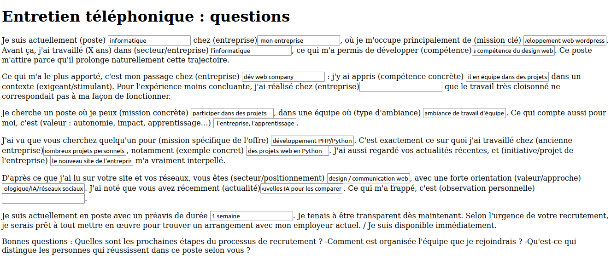

# welcome 2 job gemini coach

Things you may want to cover:
* automatiser les demarches de recherche d'emploi avec gems
* gemini live
* le quiz interactif
* presentez vous (le pitch de présentation)
* moi, vous, nous : la lettre de motivation
* mots-cles dans le CV / la lettre de motivation pour une offre d"emploi
* hero section
* portfolio
* nano banana
* canvas gemini
* booster son cv
* publier du contenu sur linkedin
* le linkedin resume
* garder une liste d'offres où j'ai postulé et les réponses/relances
* deep research
* la méthode ikigai
* comporte toi comme un coach et trouve mes points forts
* entretien téléphonique 
-  Je suis actuellement (poste) informatique chez (entreprise) mon entreprise, où je m'occupe principalement de (mission clé) développement web wordpress. Avant ça, j'ai travaillé (X ans) dans (secteur/entreprise)l'informatique, ce qui m'a permis de développer (compétence) la compétence du design web. Ce poste m'attire parce qu'il prolonge naturellement cette trajectoire. , Ce qui m'a le plus apporté, c'est mon passage chez (entreprise) dév web company : j'y ai appris (compétence concrète) le travail en équipe dans des projets dans un contexte (exigeant/stimulant). Pour l'expérience moins concluante, j'ai réalisé chez (entreprise) que le travail très cloisonné ne correspondait pas à ma façon de fonctionner. , Je cherche un poste où je peux (mission concrète) participer dans des projets, dans une équipe où (type d'ambiance) il y a une ambiance de travail d'équipe. Ce qui compte aussi pour moi, c'est (valeur : autonomie, impact, apprentissage…) l'autonomie, l'impact de l'entreprise, l'apprentissage. , J'ai vu que vous cherchez quelqu'un pour (mission spécifique de l'offre) le développement PHP/Python. C'est exactement ce sur quoi j'ai travaillé chez (ancienne entreprise)mon ancienne formation de master et de nombreux projets personnels, notamment (exemple concret) des projets web en Python. J'ai aussi regardé vos actualités récentes, et (initiative/projet de l'entreprise) le nouveau site de l'entreprise m'a vraiment interpellé. , D'après ce que j'ai lu sur votre site et vos réseaux, vous êtes (secteur/positionnement) du design / communication web, avec une forte orientation (valeur/approche)développement web/projet technologique/IA/réseaux sociaux. J'ai noté que vous avez récemment (actualité)utilisé l'IA , testé les nouvelles IA pour les comparer. Ce qui m'a frappé, c'est (observation personnelle). , Je suis actuellement en poste avec un préavis de durée 1 semaine. Je tenais à être transparent dès maintenant. Selon l'urgence de votre recrutement, je serais prêt à tout mettre en œuvre pour trouver un arrangement avec mon employeur actuel. / Je suis disponible immédiatement. , Bonnes questions : Quelles sont les prochaines étapes du processus de recrutement ? -Comment est organisée l'équipe que je rejoindrais ? -Qu'est-ce qui distingue les personnes qui réussissent dans ce poste selon vous ? 
